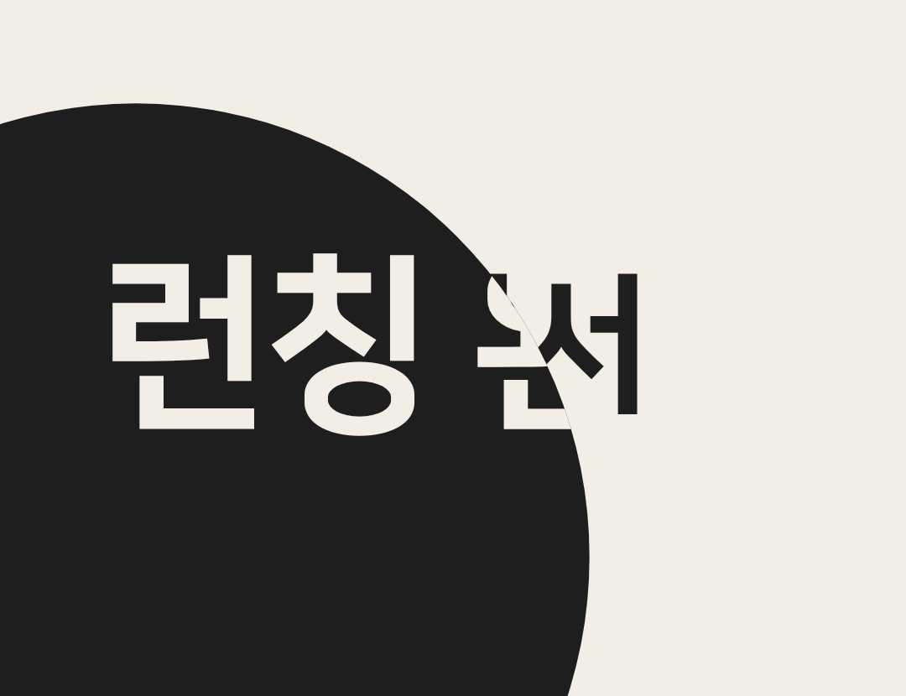

# circle-pop example

"기획서" on paper is swallowed by a charcoal circle that pops from the lower left with a strong 1.25x overshoot, fills the frame and becomes scene B, "런칭 완료".

## Preview

[](media/circle-pop.mp4)

[media/circle-pop.mp4](media/circle-pop.mp4): 1080x830, 30 fps, 6.0 s, 176 KB, no audio (the recipe has no music bed or SFX). Poster: the snapshot at 3.7 s (`T + 0.7`, circle mid-fill with text B on it).

## Command

(a) Slash form:

```text
/video:hf-motion circle-pop 'textA=기획서' 'textB=런칭 완료' popOrigin=0.15,0.8 popColor=charcoal overshoot=1.25
```

(b) Plain CLI (exactly what was run, with `./out` as the work dir):

```sh
HFM="$PWD/skills/hf-motion"
PLUGIN=$(bash "$HFM/scripts/find-hf-plugin.sh") || exit 1
node "$HFM/scripts/scaffold.mjs" circle-pop ./out 'textA=기획서' 'textB=런칭 완료' 'popOrigin=0.15,0.8' 'popColor=charcoal' 'overshoot=1.25'
# -> [OK] circle-pop scaffolded at ./out (6s, no music)
# -> verify-render args: --duration 6 --width 1080 --height 830
cd out
node "$PLUGIN/skills/hyperframes/scripts/plugin-cli.mjs" lint .
node "$PLUGIN/skills/hyperframes/scripts/plugin-cli.mjs" check .
node "$PLUGIN/skills/hyperframes/scripts/plugin-cli.mjs" snapshot . --at 1,3,3.2,3.4,3.55,3.7,3.9,5.9 --no-end --describe false
node "$PLUGIN/skills/hyperframes/scripts/plugin-cli.mjs" render . -q high -o ./renders/video.mp4
python3 "$HFM/scripts/verify-render.py" renders/video.mp4 --duration 6 --width 1080 --height 830
```

## Parameters used

| Key | Value | What it changes on screen | Limit |
|-----|-------|---------------------------|-------|
| `textA` | `기획서` | scene A text, 180 px, one line | text; shrinks to fit 920 px |
| `textB` | `런칭 완료` | scene B text, pops in on the circle | text; shrinks to fit 920 px |
| `transitionAt` | `3` (default) | when the circle starts | 0.5..4 |
| `popOrigin` | `0.15,0.8` | circle starts at (162, 664) px, lower left | `center` or `x,y` fractions 0..1 |
| `popColor` | `charcoal` | circle = scene B background; text B turns paper | `paper` / `charcoal` / `red` |
| `overshoot` | `1.25` | peak radius and text B peak scale 1.25x rest (default 1.15) | 1..1.5 |
| `paper` / `charcoal` / `red` | defaults `#f2eee6` / `#1e1e1e` / `#e5322d` | palette; scene A stays paper since `popColor` is not paper | `#rrggbb` |

## Timeline for these params

`T = 3`, POP 0.4 s, FILL 0.5 s, total fixed at 6 s. Scaffold wrote `sA 0 / 3.9`, `sB 3 / 3` (start / duration). `R0 = 0.25 x 830 = 207.5` px; `RC` = distance from (162, 664) to the top-right corner = 1133 px.

| Phase | Window (s) | Radius / what happens |
|-------|------------|-----------------------|
| scene A | 0.0-3.0 | `기획서` settles (scale 1.08 -> 1, 0.8 s), holds |
| pop up | 3.0-3.24 | 0 -> 259 px (`R0 x 1.25`, cubic out) |
| settle | 3.24-3.4 | 259 -> 207.5 px (sine in-out) |
| fill | 3.4-3.9 | 207.5 -> 1133 px (quad in); clip removed at 3.9, `sA` leaves |
| text B | 3.4-3.95 | opacity 0 -> 1, scale 0.7 -> 1.25 over 0.33 s, then -> 1 over 0.22 s |
| hold | 3.9-6.0 | `런칭 완료` paper on charcoal, 2.1 s |

## What to expect when you verify

lint: `◇  0 error(s), 2 warning(s)`, both `nested_structure_needs_subcomposition` (`#sA`, `#sB`), accepted.

check (as printed):

```text
  0 error(s), 2 warning(s), 0 info(s)
Runtime   ◇ 0 errors, 0 warnings
Layout    ◇ 0 issues across 9 sample(s)
Motion    ◇ 0 errors, 0 warnings
Contrast  ◇ 5/5 text checks pass WCAG AA
◇  Check passed
```

verify-render:

```text
[OK]   video h264 1080x830 @ 30/1
[OK]   duration 6.000s (want 6.0s)
[SKIP] audio: no --bpm, recipe has no music bed
```

Snapshots (`Fonts: 1 loaded`):

| Time | Should show |
|------|-------------|
| 1.0 | `기획서` charcoal on paper |
| 3.0 (`T`) | pure A, no circle |
| 3.2 (`T+0.2`) | charcoal circle at the lower left, near its 1.25x peak |
| 3.4 (`T+0.4`) | the circle visibly smaller than at 3.2 (the overshoot settled) |
| 3.55 (`T+0.55`) | circle growing, first syllable of text B appearing inside it |
| 3.7 (`T+0.7`) | circle covers most of the frame, `런칭 완` on it, the edge still sweeping `기획서` |
| 3.9 (`T+0.9`) | charcoal edge to edge (measured: every border pixel `#1e1e1e`), `런칭 완료` in paper |
| 5.9 | same, settled |

## Variations (scaffold-verified, not rendered)

Each printed `[OK] circle-pop scaffolded ... (6s, no music)` and passed `check`.

```sh
# red circle from the top-right corner, maximum overshoot, earlier change
node "$HFM/scripts/scaffold.mjs" circle-pop ./out-red 'textA=질문' 'textB=정답' 'popOrigin=0.9,0.1' 'popColor=red' 'overshoot=1.5' 'transitionAt=2'
# paper circle from the centre with no overshoot; scene A flips to charcoal
node "$HFM/scripts/scaffold.mjs" circle-pop ./out-paper 'textA=초안' 'textB=최종본' 'popColor=paper' 'overshoot=1'
```

## Pitfalls

Each refusal exits 2 and writes nothing.

Change too late (`transitionAt=4.5`):

```text
[hf-motion] invalid parameters:
  - transitionAt must be 0.5..4 (keeps scene B on screen after the circle covers), got 4.5
```

Overshoot too large (`overshoot=2`):

```text
[hf-motion] invalid parameters:
  - overshoot must be 1..1.5, got 2
```

Origin off the frame (`popOrigin=1.2,0.5`):

```text
[hf-motion] invalid parameters:
  - popOrigin must be "center" or "x,y" with 0..1 fractions, got 1.2,0.5
```

Fixed (#18), kept for the record: the same params with `transitionAt=2.5` used to print `✗ #textB 1:1 (need 3:1, t=3s)` under Contrast. The contrast pass samples a fixed 3 s instant, mid-circle, and takes the median pixel of the whole text box; most of B's box was still outside the circle, so paper text B was measured on scene A's paper. The template now sets `data-layout-ignore` on both texts only while the circle is partial, and the same params pass with `Contrast ◇ 4/4 text checks pass WCAG AA`. This example still uses `transitionAt=3`; both values are valid.
