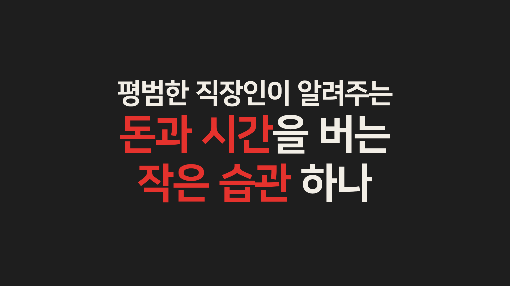

# intro-kinetic example

A 15 s kinetic-typography self-intro for the sample persona "홍길동" (가나다팀), with two tools, three flash words and a three-line finale, cut on a 116 BPM grid.

## Preview

[](media/intro-kinetic.mp4)

[media/intro-kinetic.mp4](media/intro-kinetic.mp4): 1920x1080, 30 fps, 15.0 s, 1.47 MB, audio yes (generated 116 BPM music bed + bundled SFX). Poster: the snapshot at 13.97 s (finale, all three lines in).

## Command

All on-screen facts are generic sample text (the persona from `references/help.md`), not a real person.

(a) Slash form:

```text
/video:hf-motion intro-kinetic 'title=홍길동 자기소개' name=홍길동 team=가나다팀 'employer=소프트웨어 엔지니어' years=12 'subsLabel=블로그 구독자' subsTarget=123000 'tools=Notion Kit|Daily Log' 'flash=습관|기록|성장' 'finale=평범한 직장인이 알려주는|[돈과 시간]을 버는|[작은 습관] 하나' bpm=116
```

(b) Plain CLI (exactly what was run, with `./out` as the work dir):

```sh
HFM="$PWD/skills/hf-motion"
PLUGIN=$(bash "$HFM/scripts/find-hf-plugin.sh") || exit 1
node "$HFM/scripts/scaffold.mjs" intro-kinetic ./out 'title=홍길동 자기소개' 'name=홍길동' 'team=가나다팀' 'employer=소프트웨어 엔지니어' 'years=12' 'subsLabel=블로그 구독자' 'subsTarget=123000' 'tools=Notion Kit|Daily Log' 'flash=습관|기록|성장' 'finale=평범한 직장인이 알려주는|[돈과 시간]을 버는|[작은 습관] 하나' 'bpm=116'
# -> wrote assets/music.wav and assets/music.m4a
# -> [OK] intro-kinetic scaffolded at ./out (15s @ 116 BPM)
# -> verify-render args: --duration 15 --bpm 116
cd out
node "$PLUGIN/skills/hyperframes/scripts/plugin-cli.mjs" lint .
node "$PLUGIN/skills/hyperframes/scripts/plugin-cli.mjs" check .
node "$PLUGIN/skills/hyperframes/scripts/plugin-cli.mjs" snapshot . --at 0.93,3.41,5.9,8.59,10.55,12.21,13.97 --no-end --describe false
node "$PLUGIN/skills/hyperframes/scripts/plugin-cli.mjs" render . -q high -o ./renders/video.mp4
python3 "$HFM/scripts/verify-render.py" renders/video.mp4 --duration 15 --bpm 116
```

## Parameters used

| Key | Value | What it changes on screen | Limit |
|-----|-------|---------------------------|-------|
| `title` | `홍길동 자기소개` | document title only (not on screen); set it so the author's default title does not leak | text |
| `name` | `홍길동` | scene 1 slam, 300 px, red underline bar | text; shrinks to fit 1600 px |
| `team` | `가나다팀` | scene 1 subtitle (beat 2) | text |
| `employer` | `소프트웨어 엔지니어` | scene 2 title line | text |
| `years` | `12` | scene 2 number, counted up from 0 | integer 0..999 |
| `yearsUnit` | `년차` (default) | unit after the number | text |
| `subsLabel` | `블로그 구독자` | scene 3 title line | text |
| `subsTarget` | `123000` | scene 3 count-up target, lands on `12만 3천` | integer; `ko` format needs >= 1000 |
| `subsFormat` | `ko` (default) | 만/천 formatting | `ko` / `comma` |
| `toolsLabel` | `직접 만든 [AI] 도구` (default) | scene 4 label, `AI` in accent | `[...]` = accent |
| `tools` | `Notion Kit\|Daily Log` | scene 4: first slides in (paper), second slams in (red) | 1..3 items |
| `flash` | `습관\|기록\|성장` | scene 5: one word per beat, backgrounds cycle accent / paper / charcoal | 2..8 items |
| `finale` | `평범한 직장인이 알려주는\|[돈과 시간]을 버는\|[작은 습관] 하나` | scene 6: small lead + two big lines, bracketed words in red | 1..4 lines |
| `bpm` | `116` | every cut, the music bed and the total length | 90..150 |
| `paper` / `charcoal` / `red` | defaults `#f2eee6` / `#1e1e1e` / `#e5322d` | palette | `#rrggbb`; red keeps 3:1 on both others |

## Timeline for these params

`B = 60/116 = 0.5172 s`, T=2, F=3, L=3: total `16 + 4 + 3 + 6 = 29` beats = 15.0 s. Windows below are the `data-start` / `data-duration` the scaffold wrote.

| Scene | Window (s) | On the beats (s) |
|-------|------------|------------------|
| s1 name | 0.000-2.069 | 0.000 name slam + shake · 0.517 bar · 1.034 subtitle `가나다팀` |
| t12 | 2.069-2.328 | red panel lifts away |
| s2 employer + years | 2.069-4.138 | 2.069 title · 2.328 number row · 2.586 count 0 -> 12 (0.9 s) · 3.103 `년차` + pulse |
| s3 subscribers | 4.138-6.207 | 4.138 title · 4.655 count -> `12만 3천` (1.0 s) · 5.690 pulse |
| s4 tools | 6.207-9.310 | 6.207 label · 7.241 `Notion Kit` · 8.276 `Daily Log` |
| s5 flash | 9.310-10.862 | 9.310 `습관` · 9.828 `기록` · 10.345 `성장` |
| s6 finale | 10.862-15.000 | 10.862 lead line · 11.897 `돈과 시간을 버는` · 12.931 `작은 습관 하나` · hold |

Audio (static attributes): music 0-15 s; impact at 0 and 10.862; whooshes at 1.769, 3.838, 5.907, 9.010 (0.3 s before the cuts into s2..s5).

## What to expect when you verify

lint: `◇  0 error(s), 9 warning(s)` = 7 `nested_structure_needs_subcomposition` (one per scene clip) + 1 `composition_file_too_large` + 1 `timeline_track_too_dense`, all accepted by `references/verification.md`.

check (as printed):

```text
Runtime   ◇ 0 errors, 0 warnings
Layout    ℹ t=4.17s text_box_overflow #s3-title inside div.mask overflowed bottom 91.56px "블로그 구독자"
          ℹ t=4.17s container_overflow #s3-title inside div.mask overflowed bottom 92.06px
          ℹ t=12.5s container_overflow span.fin-big inside div.mask overflowed bottom 186.21px
          0 error(s), 0 warning(s), 3 info(s)
Motion    ◇ 0 errors, 0 warnings
Contrast  ◇ 11/11 text checks pass WCAG AA
◇  Check passed
```

The three `info` lines are the accepted mask-reveal / finale-before-its-beat cases.

verify-render:

```text
[OK]   video h264 1920x1080 @ 30/1
[OK]   duration 15.000s (want 15.0s)
[OK]   audio aac
[OK]   audio peak -1.6 dBFS (want -6..-0.1)
[OK]   kick grid: on-beat onset median 49.5 vs half-beat 2.0 (want >=10 and >=5x)
```

Snapshots (`Fonts: 1 loaded`). Times are the 120 BPM defaults scaled by 120/116, scenes 4-6 shifted by the changed flash count:

| Time | Should show |
|------|-------------|
| 0.93 | `홍길동` in paper on charcoal with the red bar (subtitle not yet in) |
| 3.41 | `소프트웨어 엔지니어` over a red `12` + `년차` |
| 5.9 | paper background, `블로그 구독자` over red `12만 3천` |
| 8.59 | `직접 만든 AI 도구` (AI red), `Notion Kit` paper, `Daily Log` red |
| 10.55 | `성장` in red, full frame |
| 12.21 | lead line + `돈과 시간을 버는` (돈과 시간 red) |
| 13.97 | all three finale lines; `작은 습관` red |

## Variations (scaffold-verified, not rendered)

Each printed `[OK] intro-kinetic scaffolded ...`; each also passed `check` (Contrast all pass).

```sh
# another persona, comma counter with a custom final label (15s @ 120 BPM)
node "$HFM/scripts/scaffold.mjs" intro-kinetic ./out-kim 'name=김민지' 'team=디자인팀' 'employer=프로덕트 디자이너' 'years=7' 'subsLabel=뉴스레터 구독자' 'subsTarget=48200' 'subsFormat=comma' 'subsDisplay=4.8만+'
# three tools, five flash words, one finale line: 16+6+5+2 = 29 beats -> 15s @ 116 BPM
node "$HFM/scripts/scaffold.mjs" intro-kinetic ./out-lists 'tools=Notion Kit|Daily Log|Focus Timer' 'flash=읽기|쓰기|정리|공유|반복' 'finale=[매일] 조금씩' 'bpm=116'
# navy palette with a darker accent (15s @ 120 BPM)
node "$HFM/scripts/scaffold.mjs" intro-kinetic ./out-navy 'name=홍길동' 'paper=#fafafa' 'charcoal=#14213d' 'red=#d62828'
```

## Pitfalls

Each refusal exits 2 and writes nothing.

Tempo out of range (`bpm=160`):

```text
[hf-motion] invalid parameters:
  - bpm must be 90..150, got 160
```

Too many tools (`tools=A|B|C|D`):

```text
[hf-motion] invalid parameters:
  - tools needs 1..3 items, got 4
```

Unknown key (`nickname=길동`):

```text
[hf-motion] unknown key 'nickname'. Keys: title, name, team, employer, years, yearsUnit, subsLabel, subsTarget, subsDisplay, subsFormat, toolsLabel, tools, flash, finale, paper, charcoal, red, bpm
```

Not refused by the scaffold, but by `check`:

- The accent contrast rule is not validated at scaffold time. `red=#fca311` on `paper=#fafafa` scaffolds `[OK]`, then `check` reports a `1.94:1 (need 3:1)` contrast failure in the flash scene.
- Fixed (#18): the same three-list variation at `bpm=132` used to flag `#s2-title` / `#s2-unit` at `1:1 (need 3:1, t=3.662s)`: the contrast sample landed mid paper-iris and the median pixel of each text box was the iris's paper. Each scene-exit panel now sets `data-layout-ignore` on the scene's text while it moves, and `bpm=132` passes with `Contrast ◇ 7/7 text checks pass WCAG AA`.
