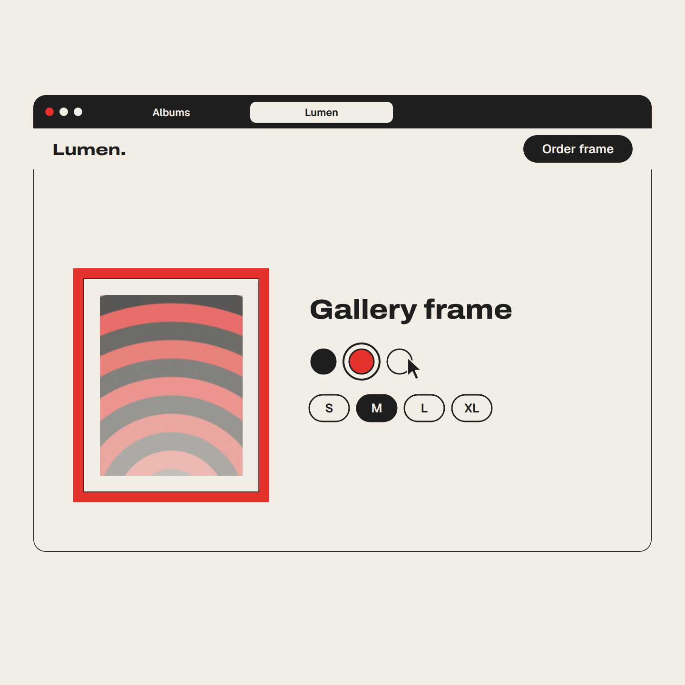

# launch-film example

A 25.3 s, 1440x1440 keynote-style launch film for an invented photo brand "Lumen", at 128 BPM with nine original abstract photos.

## Preview

[](media/launch-film.mp4)

[media/launch-film.mp4](media/launch-film.mp4): 1440x1440, 30 fps, 25.33 s (760 frames), 2.1 MB, AAC audio: yes. The raw render was 8.9 MB (8,855,296 bytes); this copy is re-encoded with `ffmpeg -c:v libx264 -crf 28 -preset slow -c:a copy -movflags +faststart` and passes the same verify-render checks.

The poster is the snapshot at 18.516 s (beat 39.5): the second frame colour
(red) painted on, size `M` filled, `Gallery frame` and both Safari tabs on screen.

## Command

The nine photos in `docs/examples/assets/launch-film-photos/` are abstract
compositions drawn for this example (the recipe's own
`templates/launch-film/scripts/make_photos.py --variant 3`, cropped to
1200x900 JPEG, palette blends only); they are not real photos. Substitute your own 9..12 `.jpg/.png/.webp` files; their
basenames must differ.

(a) Slash form:

```text
/video:hf-motion launch-film wordmark=Lumen openLabel=Albums glassWord=Prism photos=docs/examples/assets/launch-film-photos/photo-1.jpg|docs/examples/assets/launch-film-photos/photo-2.jpg|docs/examples/assets/launch-film-photos/photo-3.jpg|docs/examples/assets/launch-film-photos/photo-4.jpg|docs/examples/assets/launch-film-photos/photo-5.jpg|docs/examples/assets/launch-film-photos/photo-6.jpg|docs/examples/assets/launch-film-photos/photo-7.jpg|docs/examples/assets/launch-film-photos/photo-8.jpg|docs/examples/assets/launch-film-photos/photo-9.jpg "lockTime=7:15" "lockDate=Friday 3 October" "trackTitle=Slow Tide" "trackArtist=Harbor Lane" "landingHeadline=Hang the light you saw." "productName=Gallery frame" frameColors=charcoal|red|paper sizes=S|M|L|XL "orderLabel=Order frame" steps=Placed|Framing|Shipped|Arrived bpm=128
```

(b) Plain CLI, run from the repo root. This is exactly what produced the
preview (the example used a scratch directory in place of `./out`). The render
took 7 min 38 s (CLI: `rendered in 7m 37.7s`) here; expect about 9 minutes.

```sh
HFM="$PWD/skills/hf-motion"
PLUGIN=$(bash "$HFM/scripts/find-hf-plugin.sh") || exit 1
P=docs/examples/assets/launch-film-photos
node "$HFM/scripts/scaffold.mjs" launch-film ./out 'wordmark=Lumen' 'openLabel=Albums' 'glassWord=Prism' \
  "photos=$P/photo-1.jpg|$P/photo-2.jpg|$P/photo-3.jpg|$P/photo-4.jpg|$P/photo-5.jpg|$P/photo-6.jpg|$P/photo-7.jpg|$P/photo-8.jpg|$P/photo-9.jpg" \
  'lockTime=7:15' 'lockDate=Friday 3 October' 'trackTitle=Slow Tide' 'trackArtist=Harbor Lane' \
  'landingHeadline=Hang the light you saw.' 'productName=Gallery frame' 'frameColors=charcoal|red|paper' \
  'sizes=S|M|L|XL' 'orderLabel=Order frame' 'steps=Placed|Framing|Shipped|Arrived' 'bpm=128'
cd out
node "$PLUGIN/skills/hyperframes/scripts/plugin-cli.mjs" lint .
node "$PLUGIN/skills/hyperframes/scripts/plugin-cli.mjs" check .
T=$(python3 -c "print(','.join(['0']+[repr((b+0.5)*60/128) for b in range(54)]+[str(round(34.88*60/128,3)),str(round(54*60/128-1/30,4))]))")
node "$PLUGIN/skills/hyperframes/scripts/plugin-cli.mjs" snapshot . --at "$T" --no-end --describe false
node "$PLUGIN/skills/hyperframes/scripts/plugin-cli.mjs" render . -q high -o ./renders/video.mp4
python3 "$HFM/scripts/verify-render.py" renders/video.mp4 --duration 25.3125 --bpm 128 --width 1440 --height 1440
```

Scaffold output: `[OK] launch-film scaffolded at ... (25.3125s @ 128 BPM)` and
`verify-render args: --duration 25.3125 --bpm 128 --width 1440 --height 1440`.

## Parameters used

Palette left at the defaults (`paper=#f2eee6`, `charcoal=#1e1e1e`, `red=#e5322d`).

| key | value | what it changes on screen | limit |
|-----|-------|---------------------------|-------|
| `wordmark` | `Lumen` | opening/closing wordmark, second tab label, landing nav logo | 3..9 letters A-Z/a-z |
| `openLabel` | `Albums` | label in the black pill, gallery page title, first tab | <= 16 |
| `glassWord` | `Prism` | liquid-glass word that melts into the toolbar | 3..8 letters |
| `photos` | `photo-1.jpg` .. `photo-9.jpg` | `[0]` hero/relight, `[1]` wallpaper/landing hero/print, all in the 3x3 grid, `[2..]` the gallery page | 9..12 files, distinct basenames |
| `lockTime` | `7:15` | glass clock digits | `H:MM` |
| `lockDate` | `Friday 3 October` | date above the clock | <= 24 |
| `trackTitle` / `trackArtist` | `Slow Tide` / `Harbor Lane` | glass music player | <= 28 each |
| `landingHeadline` | `Hang the light you saw.` | headline over the landing hero | <= 40 |
| `productName` | `Gallery frame` | product page title | <= 24 |
| `frameColors` | `charcoal\|red\|paper` | swatches; molding starts charcoal, the click paints red (also the wall frame) | 2..3 distinct palette names |
| `sizes` | `S\|M\|L\|XL` | size chips; the click fills `M` | 2..4 items, <= 6 chars |
| `orderLabel` | `Order frame` | nav button that flies into the order button | <= 18 |
| `steps` | `Placed\|Framing\|Shipped\|Arrived` | four states of the order shape | exactly 4 |
| `bpm` | `128` | whole 54-beat skeleton, music bed tempo | 90..150 |

## Timeline for these params

`B = 60 / 128 = 0.46875 s`; total `54 B = 25.3125 s`.

| beats | seconds | scene |
|-------|---------|-------|
| 0-2 | 0.000-1.406 | `Lumen.` squeezes into its period, period grows into the pill, `Albums` rises |
| 3-5 | 1.406-2.813 | click: iris closes, opens on `photos[0]`, circle becomes a square |
| 6-10 | 2.813-5.156 | tile shrinks, 3x3 grid unfolds, reflows into a bento |
| 11-12 | 5.156-6.094 | click hero, camera zoom; the drop lands at 5.625 |
| 13-16 | 6.094-7.969 | `Prism` pops, melts into a glass toolbar, click adjust |
| 17-21 | 7.969-10.313 | slider, knob becomes a lens, drag relights to golden hour, release |
| 22-25 | 10.313-12.188 | orb opens `photos[1]`, lock screen `7:15` / `Friday 3 October`, music player |
| 26-28 | 12.188-13.594 | pull back to a phone, Dynamic Island pinches off |
| 29-33 | 13.594-15.938 | blob becomes a Mac window, `Albums` gallery, long-press, card dragged to the `Lumen` tab |
| 34-35 | 15.938-16.875 | landing page, headline rises, scroll turns the hero into the print |
| 36-41 | 16.875-19.688 | frame grows, `Gallery frame`, red painted, `M` filled, `Order frame` flies down, click |
| 42-47 | 19.688-22.500 | order shape: `Placed`, `Framing` + %, `Shipped` + van, `Arrived` |
| 48-49 | 22.500-23.438 | circle floods the frame black |
| 50-52.3 | 23.438-24.516 | black contracts into the red-framed print on the wall, iris open/close, flood |
| 52.3-54 | 24.516-25.313 | black contracts into the pill, `Lumen.` springs back; loops to frame 0 |

## What to expect when you verify

- lint: `0 error(s), 2 warning(s)` -- `composition_file_too_large` and
  `nested_structure_needs_subcomposition` on `#film`, both accepted for this recipe.
- check: Runtime `0 errors, 0 warnings`, Layout `0 issues across 9 sample(s)`,
  Motion `0 errors, 0 warnings`, Contrast `12/12 text checks pass WCAG AA`, last line `Check passed`.
- snapshot: 57 frames, `0`, `(b + 0.5) * 0.46875` for b = 0..53
  (`0.234375, 0.703125, ..., 25.078125`), `16.35` (headline whole) and `25.2792` (last frame). Each must
  show the scene of its beat row above with the strings exactly as passed.
  Frames worth a close look: 1.172 (`Albums` in the pill), 6.328 (`Prism`
  popping in, partly drawn), 11.484 (`7:15`, `Friday 3 October`), 11.953
  (`Slow Tide` / `Harbor Lane`), 14.766 (gallery titled `Albums`, photos 3..9),
  18.516 (product page), 19.922 / 20.391 / 21.328 / 22.266 (`Placed`,
  `Framing 13%`, `Shipped`, `Arrived`), 24.141 (red frame on the wall).
  The headline is only fully visible between beats 34 and 35: at the b + 0.5
  sample 16.172 it is still rising behind the hero; the `16.35` snapshot
  (`34.88 * 60 / bpm`) shows `Hang the light you saw.` whole.
- verify-render:

```text
[OK]   video h264 1440x1440 @ 30/1
[OK]   duration 25.333s (want 25.3125s)
[OK]   audio aac
[OK]   audio peak -2.5 dBFS (want -6..-0.1)
[OK]   kick grid: on-beat onset median 26.7 vs half-beat 1.1 (want >=10 and >=5x)
```

- Loop: the snapshot at 25.2792 equals frame 0 (pixel max diff 0).
  In the encoded mp4 the last frame differs from frame 0 by max 60 / 255 on
  237 pixels around the glyph edges: h264 noise, since each decoded frame
  already differs from the lossless snapshot by max 51-52. Compare snapshots,
  not decoded mp4 frames, for the exact check. The mp4 has 760 frames (25.333 s)
  because 25.3125 s is not a whole number of 30 fps frames.

## Variations

Each was scaffolded into a throwaway directory and its `CONFIG` inspected;
**scaffold-verified, not rendered**. `$P` as above,
`$PL=skills/hf-motion/templates/launch-film/assets/photos` (the recipe's own placeholders).

1. Twelve photos (the maximum): `"photos=$P/photo-1.jpg|...|$P/photo-9.jpg|$PL/photo-01.jpg|$PL/photo-02.jpg|$PL/photo-03.jpg"`.
   `photo-1.jpg` and `photo-01.jpg` are different basenames, so all twelve are copied;
   `photos[2..]` (ten) go to the gallery page. Output: `(27s @ 120 BPM)`.
2. Slower tempo: `'bpm=96'` stretches the same 54 beats to
   `(33.75s @ 96 BPM)`, `verify-render args: --duration 33.75 --bpm 96 --width 1440 --height 1440`.
3. Two frame colours and a darker accent: `'frameColors=paper|red' 'sizes=A4|A3' 'red=#c0392b'`.
   The molding starts paper and the click paints red; `#c0392b` passes the 3:1 contrast gate. Output: `(27s @ 120 BPM)`.

## Pitfalls

Each refusal exits with status 2 and writes nothing.

- Same basename twice (`photos=$P/photo-1.jpg|$P/photo-1.jpg|$P/photo-3.jpg|...|$P/photo-9.jpg`):

  ```text
  [hf-motion] photos: two files named photo-1.jpg
  ```

  Files from different folders with the same name collide too, since each lands in `assets/<basename>`.
- An accent too light for the paper (`red=#f08080`):

  ```text
  [hf-motion] invalid parameters:
    - red must keep 3:1 contrast on paper, got 2.24:1
  ```

- Eight photos (`photos=$P/photo-1.jpg|...|$P/photo-8.jpg`):

  ```text
  [hf-motion] invalid parameters:
    - photos needs 9..12 images, got 8
  ```
