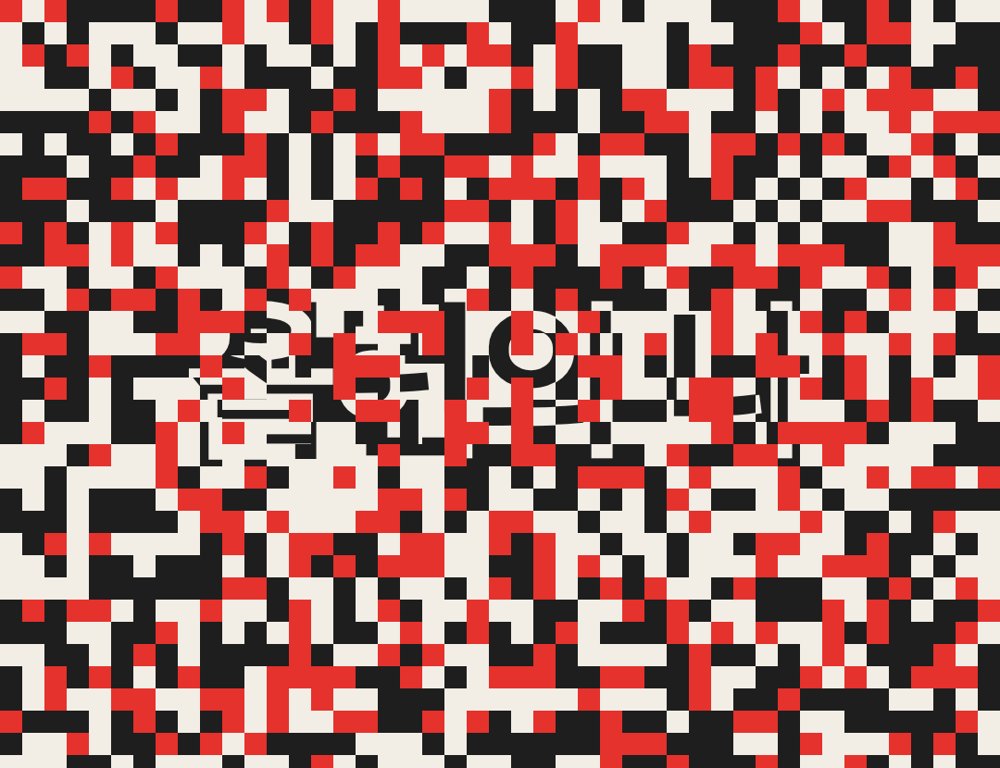

# pixel-dissolve example

"작년의 나" on paper dissolves through a fine 24 px grid of red cells into "올해의 나" on charcoal, over a slower 1.5 s transition.

## Preview

[](media/pixel-dissolve.mp4)

[media/pixel-dissolve.mp4](media/pixel-dissolve.mp4): 1080x830, 30 fps, 6.0 s, 197 KB, no audio (the recipe has no music bed or SFX). Poster: the snapshot at 3.75 s (`T + 0.5D`, mid-dissolve).

## Command

(a) Slash form:

```text
/video:hf-motion pixel-dissolve 'textA=작년의 나' 'textB=올해의 나' pixelSize=24 transitionAt=3 transitionDur=1.5 bgA=paper bgB=charcoal
```

(b) Plain CLI (exactly what was run, with `./out` as the work dir):

```sh
HFM="$PWD/skills/hf-motion"
PLUGIN=$(bash "$HFM/scripts/find-hf-plugin.sh") || exit 1
node "$HFM/scripts/scaffold.mjs" pixel-dissolve ./out 'textA=작년의 나' 'textB=올해의 나' 'pixelSize=24' 'transitionAt=3' 'transitionDur=1.5' 'bgA=paper' 'bgB=charcoal'
# -> [OK] pixel-dissolve scaffolded at ./out (6s, no music)
# -> verify-render args: --duration 6 --width 1080 --height 830
cd out
node "$PLUGIN/skills/hyperframes/scripts/plugin-cli.mjs" lint .
node "$PLUGIN/skills/hyperframes/scripts/plugin-cli.mjs" check .
node "$PLUGIN/skills/hyperframes/scripts/plugin-cli.mjs" snapshot . --at 1,3,3.45,3.75,4.2,4.5,5.9 --no-end --describe false
node "$PLUGIN/skills/hyperframes/scripts/plugin-cli.mjs" render . -q high -o ./renders/video.mp4
python3 "$HFM/scripts/verify-render.py" renders/video.mp4 --duration 6 --width 1080 --height 830
```

## Parameters used

| Key | Value | What it changes on screen | Limit |
|-----|-------|---------------------------|-------|
| `textA` | `작년의 나` | scene A text, 180 px, one line | text; shrinks to fit 920 px |
| `textB` | `올해의 나` | scene B text, same rules | text; shrinks to fit 920 px |
| `transitionAt` | `3` (= default) | when the first cell flips | 0.5..4.5 |
| `transitionDur` | `1.5` | first cell to last (default 1) | 0.2..3; `transitionAt + transitionDur <= 5.5` |
| `pixelSize` | `24` | cell edge: 45x35 = 1575 cells (default 40 -> 567) | integer 10..200 |
| `bgA` | `paper` | scene A background; text A turns charcoal | `paper` / `charcoal` / `red` |
| `bgB` | `charcoal` | scene B background; text B turns paper | `paper` / `charcoal` / `red` |
| `paper` / `charcoal` / `red` | defaults `#f2eee6` / `#1e1e1e` / `#e5322d` | palette; red = the flash colour of each cell | `#rrggbb` |

## Timeline for these params

`T = 3`, `D = 1.5`, `F = 0.2D = 0.3`, total fixed at 6 s. Scaffold wrote `sA 0 / 4.5`, `sB 3 / 3`, `fx 3 / 1.5` (start / duration).

| Element | Window (s) | What happens |
|---------|------------|--------------|
| `sA` | 0.0-4.5 | text A settles (scale 1.08 -> 1, 0.8 s), holds, is eaten cell by cell |
| `fx` | 3.0-4.5 | cell `r` of 1575 turns red at `3 + r/1575 x 1.2` s, then to scene B 0.3 s later |
| `sB` | 3.0-6.0 | revealed cell by cell; text B settles over D + 0.5 = 2.0 s (to 5.0) |
| hold | 4.5-6.0 | pure B, 1.5 s |

Cell order is the seeded `mulberry32(719)` shuffle, so every render is identical.

## What to expect when you verify

lint: `◇  0 error(s), 2 warning(s)`, both `nested_structure_needs_subcomposition` (`#sA`, `#sB`), accepted.

check (as printed):

```text
  0 error(s), 2 warning(s), 0 info(s)
Runtime   ◇ 0 errors, 0 warnings
Layout    ◇ 0 issues across 9 sample(s)
Motion    ◇ 0 errors, 0 warnings
Contrast  ◇ 5/5 text checks pass WCAG AA
◇  Check passed
```

verify-render:

```text
[OK]   video h264 1080x830 @ 30/1
[OK]   duration 6.000s (want 6.0s)
[SKIP] audio: no --bpm, recipe has no music bed
```

Snapshots (`Fonts: 1 loaded`):

| Time | Should show |
|------|-------------|
| 1.0 | `작년의 나` charcoal on paper |
| 3.0 (`T`) | still pure A, no cell flipped |
| 3.45 (`T+0.3D`) | paper with scattered red and charcoal cells, text A still readable |
| 3.75 (`T+0.5D`) | roughly half the cells charcoal, text B fragments in paper |
| 4.2 (`T+0.8D`) | mostly charcoal, `올해의 나` readable through the last red cells |
| 4.5 (`T+D`) | pure B: `올해의 나` paper on charcoal, no red cell left (measured: 0 accent pixels) |
| 5.9 | same as 4.5, settled |

## Variations (scaffold-verified, not rendered)

Each printed `[OK] pixel-dissolve scaffolded ... (6s, no music)` and passed `check`.

```sh
# coarse 80 px blocks (14x11 = 154 cells), long early dissolve onto the accent background
node "$HFM/scripts/scaffold.mjs" pixel-dissolve ./out-coarse 'textA=계획' 'textB=실행' 'pixelSize=80' 'transitionAt=1.5' 'transitionDur=3' 'bgA=charcoal' 'bgB=red'
# Latin text, very fine 12 px grain, teal flash colour
node "$HFM/scripts/scaffold.mjs" pixel-dissolve ./out-fine 'textA=Before' 'textB=After' 'pixelSize=12' 'red=#2a9d8f'
```

With `bgB=red` the flash cells match B's background, so the B side reads as a straight swap (the recipe's documented three-colour rule).

## Pitfalls

Each refusal exits 2 and writes nothing.

Transition runs past the B hold (`transitionAt=4.5 transitionDur=1.5`):

```text
[hf-motion] invalid parameters:
  - transitionAt + transitionDur must leave a 0.5s hold on scene B (<= 5.5), got 6
```

Grid too fine (`pixelSize=5`):

```text
[hf-motion] invalid parameters:
  - pixelSize must be an integer 10..200, got 5
```

Colour outside the palette (`bgA=blue`):

```text
[hf-motion] invalid parameters:
  - bgA must be one of paper, charcoal, red, got blue
```

Fixed (#18), kept for the record: with `transitionAt=2.5 transitionDur=1.5` (and the same texts) `check` used to print `✗ #textB 1:1 (need 3:1, t=3s)` under Contrast. The contrast pass samples fixed instants (one is 3 s) and takes the median pixel of the whole text box; mid-dissolve most of B's box still shows A's paper, so paper text B was measured on paper. The template now sets `data-layout-ignore` on both texts only while cells are swapping, and the same params pass with `Contrast ◇ 4/4 text checks pass WCAG AA`. This example still uses `transitionAt=3`; both values are valid.
