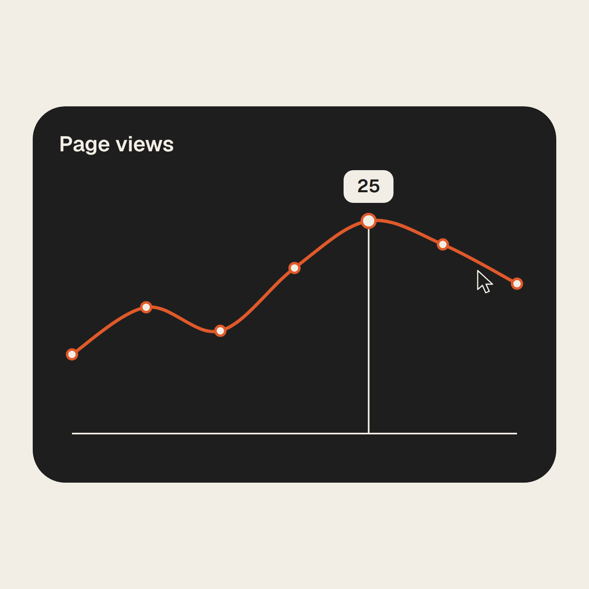

# ui-morph example

A 16 s seamless UI loop at 105 BPM: one charcoal shape morphs from a "Sign up" button through a music player, sliders, tabs, a "Page views" chart and a Cmd K palette to an "Invite sent" toast and back, with an orange accent.

## Preview

[](media/ui-morph.mp4)

[media/ui-morph.mp4](media/ui-morph.mp4): 1440x1440, 30 fps, 16.0 s (480 frames), 2.0 MB, audio yes (generated 105 BPM music bed, AAC). Poster: the snapshot at 12.4 s (beat 21), the cursor hovering the chart's peak with the "25" tooltip.

## Command

(a) Slash form:

```text
/video:hf-motion ui-morph 'buttonLabel=Sign up' 'trackTitle=Morning Run' 'trackArtist=Field Notes' 'tabs=Hourly|Daily|Weekly' 'chartTitle=Page views' 'chartData=8|14|11|19|25|22|17' 'paletteQuery=inv' 'paletteItems=Create file|Invite team|Open inbox|Share link' 'toastText=Invite sent' 'red=#e0592a' bpm=105
```

(b) Plain CLI (exactly what was run, with `./out` as the work dir; run from the repo root):

```sh
HFM="$PWD/skills/hf-motion"
PLUGIN=$(bash "$HFM/scripts/find-hf-plugin.sh") || exit 1
node "$HFM/scripts/scaffold.mjs" ui-morph ./out 'buttonLabel=Sign up' 'trackTitle=Morning Run' 'trackArtist=Field Notes' 'tabs=Hourly|Daily|Weekly' 'chartTitle=Page views' 'chartData=8|14|11|19|25|22|17' 'paletteQuery=inv' 'paletteItems=Create file|Invite team|Open inbox|Share link' 'toastText=Invite sent' 'red=#e0592a' 'bpm=105'
# -> wrote assets/music.wav and assets/music.m4a
# -> verify-render args: --duration 16 --bpm 105 --width 1440 --height 1440
cd out
node "$PLUGIN/skills/hyperframes/scripts/plugin-cli.mjs" lint .
node "$PLUGIN/skills/hyperframes/scripts/plugin-cli.mjs" check .
node "$PLUGIN/skills/hyperframes/scripts/plugin-cli.mjs" snapshot . --at 0,0.400,0.971,1.543,2.114,2.686,3.257,3.829,4.400,4.971,5.543,6.114,6.686,7.257,7.829,8.400,8.971,9.543,10.114,10.686,11.257,11.829,12.400,12.971,13.543,14.114,14.686,15.257,15.829,16 --no-end --describe false
node "$PLUGIN/skills/hyperframes/scripts/plugin-cli.mjs" render . -q high -o ./renders/video.mp4
python3 "$HFM/scripts/verify-render.py" renders/video.mp4 --duration 16 --bpm 105 --width 1440 --height 1440
```

The snapshot times are one per beat at `k * B + 0.7 * B` (`B = 60/105 = 0.5714 s`, k = 0..27) plus `0` and `16` for the loop check.

## Parameters used

| Key | Value | What it changes on screen | Limit |
|-----|-------|---------------------------|-------|
| `buttonLabel` | `Sign up` | button label at the start and end of the loop | 1..16 chars, Latin only |
| `trackTitle` | `Morning Run` | dynamic island and player title | 1..24 |
| `trackArtist` | `Field Notes` | player subtitle | 1..24 |
| `tabs` | `Hourly\|Daily\|Weekly` | the three tab labels | exactly 3 items, 1..10 chars each |
| `chartTitle` | `Page views` | chart heading | 1..28 |
| `chartData` | `8\|14\|11\|19\|25\|22\|17` | line shape; tooltip shows the max `25`, then the last point `17` | 6..8 non-negative numbers, at least one > 0 |
| `paletteQuery` | `inv` | typed into the Cmd K bar | 1..12; must match >= 1 item and filter out >= 1 |
| `paletteItems` | `Create file\|Invite team\|Open inbox\|Share link` | palette rows; only "Invite team" survives the filter and is entered | 3..5 items, 1..20 chars |
| `toastText` | `Invite sent` | toast after Enter | 1..24 |
| `red` | `#e0592a` | accent: orange check, fills, line, caret | `#rrggbb`, >= 3:1 against paper and charcoal |
| `bpm` | `105` | slower loop: 28 beats = 16 s (default 120 BPM = 14 s); music bed regenerated at 105 | 90..150; `50400 / bpm` integer for a frame-exact loop (105 -> 480 frames) |
| `paper`, `charcoal` | defaults `#f2eee6`, `#1e1e1e` | canvas / shape and cursor | charcoal >= 4.5:1 on paper |

## Timeline for these params

`B = 0.5714 s`; beat `k` starts at `k * B`. Only `#stage`, `#scene` and `#music` carry timing attributes (all `0 .. 16`).

| Beats | Seconds | State |
|-------|---------|-------|
| 0-1 | 0.000-1.143 | "Sign up" clicked, squishes, morphs to a circle with a spinner |
| 2-3 | 1.143-2.286 | ring closes; circle turns orange, check draws |
| 4 | 2.286-2.857 | dynamic island: "Morning Run", level bars |
| 5-9 | 2.857-5.714 | player: play -> pause at 3.429, progress knob dragged 4.571-5.143 |
| 10-13 | 5.714-8.000 | volume slider, dragged past max at 6.857, springs back at 7.429 |
| 14-15 | 8.000-9.143 | toggle, flips orange at 8.571 |
| 16-18 | 9.143-10.857 | tabs: indicator on "Daily", clicks "Hourly" (9.714) then "Weekly" (10.286) |
| 19-22 | 10.857-13.143 | chart "Page views" draws; tooltip 25 at 12.000, slides to 17 at 12.571 |
| 23-25 | 13.143-14.857 | Cmd K bar, types "inv", rows filter to "Invite team", hint becomes Enter |
| 26 | 14.857-15.429 | Enter -> toast "Invite sent" |
| 27 | 15.429-16.000 | toast -> button; at 16.000 = 0 the loop clicks again |

## What to expect when you verify

lint: `◇  0 error(s), 2 warning(s)`: `composition_file_too_large` (514 lines) and `nested_structure_needs_subcomposition` on `#scene`, both accepted for ui-morph in `references/verification.md`.

check (summary lines as printed):

```text
  0 error(s), 2 warning(s), 0 info(s)
Runtime   ◇ 0 errors, 0 warnings
Layout    ◇ 0 issues across 9 sample(s)
Motion    ◇ 0 errors, 0 warnings
Contrast  ◇ 4/4 text checks pass WCAG AA
◇  Check passed
```

`snapshot` reported `Fonts: 1 loaded` (Geist). Loop check: the snapshots at `0` and `16` are pixel-identical (max per-channel difference 0).

verify-render:

```text
[OK]   video h264 1440x1440 @ 30/1
[OK]   duration 16.000s (want 16.0s)
[OK]   audio aac
[OK]   audio peak -2.7 dBFS (want -6..-0.1)
[OK]   kick grid: on-beat onset median 23.3 vs half-beat 0.8 (want >=10 and >=5x)
```

Snapshots worth opening (all 30 were read; only Latin text, Geist, three colours):

| Time | Should show |
|------|-------------|
| 0.400 | "Sign up ->" button, cursor on it |
| 2.114 | orange circle with a check |
| 2.686 | island: orange art, "Morning Run", orange level bars |
| 3.829 | player "Morning Run / Field Notes", pause icon |
| 6.686 | volume slider at max, knob enlarged under the cursor |
| 10.114 | tabs with the indicator under "Hourly" |
| 12.400 | chart, tooltip "25" at the peak (poster) |
| 12.971 | tooltip "17" on the last point |
| 14.686 | palette "inv", one row "Invite team" highlighted, hint "Enter" |
| 15.257 | toast "Invite sent" with an orange check |
| 0 and 16 | identical "Sign up" frames |

## Variations (scaffold-verified, not rendered)

Each was scaffolded into a throwaway dir and succeeded (music bed written, `[OK] ui-morph scaffolded`).

```sh
# default tempo, other copy -> "(14s @ 120 BPM)", verify args --duration 14 --bpm 120
node "$HFM/scripts/scaffold.mjs" ui-morph ./out-demo 'buttonLabel=Book a demo' 'trackTitle=Late Shift' 'trackArtist=Quiet Hours' 'tabs=Day|Week|Year' 'toastText=Demo booked' 'bpm=120'
# faster loop, 6-point chart, 3-row palette -> "(12s @ 140 BPM)", verify args --duration 12 --bpm 140
node "$HFM/scripts/scaffold.mjs" ui-morph ./out-orders 'chartTitle=Orders' 'chartData=3|5|4|9|7|12' 'paletteQuery=set' 'paletteItems=Open settings|Reset password|Log out' 'toastText=Settings opened' 'bpm=140'
```

## Pitfalls

Each refusal exits 2 and writes nothing.

Hangul text (`buttonLabel=시작하기`); ui-morph is Latin only:

```text
[hf-motion] invalid parameters:
  - buttonLabel '시작하기' has characters outside the bundled Geist (Latin) face
```

A query that filters nothing out (`paletteQuery=e paletteItems=New file|Open recent|Delete note`):

```text
[hf-motion] invalid parameters:
  - paletteQuery 'e' matches every paletteItem; at least one must filter out
```

Wrong tab count and tempo out of range (`tabs=Day|Week bpm=160`); every violation is listed at once:

```text
[hf-motion] invalid parameters:
  - tabs needs 3..3 items, got 2
  - bpm must be 90..150, got 160
```

Tempo choice: `bpm=105` was picked because `50400 / 105 = 480` is a whole number of frames, so the seam lands exactly on a frame. A tempo such as 110 is accepted but gives 15.27 s and a seam between frames.
